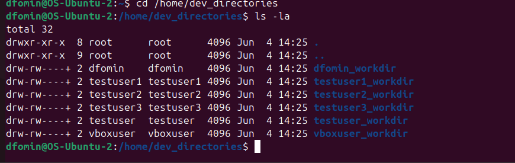
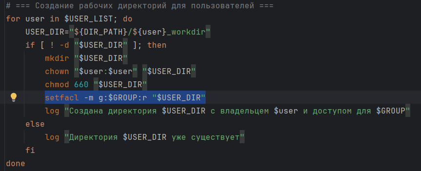
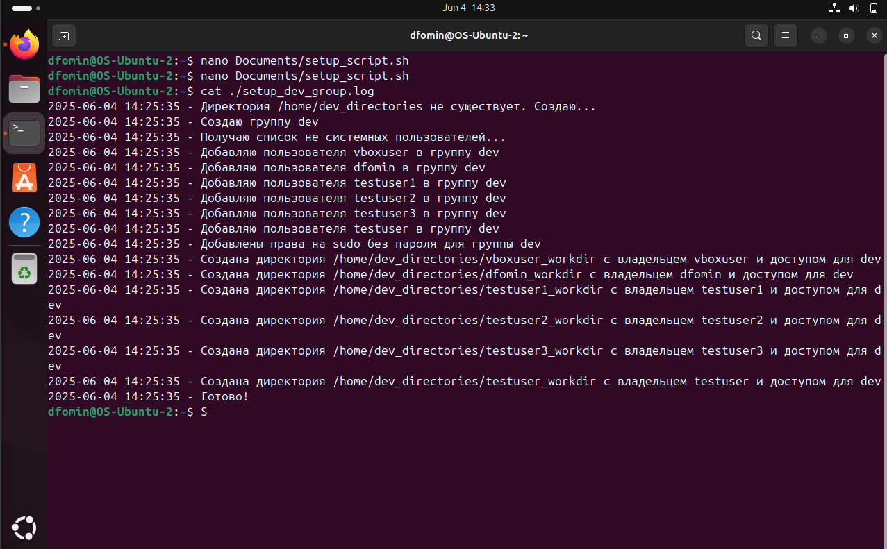
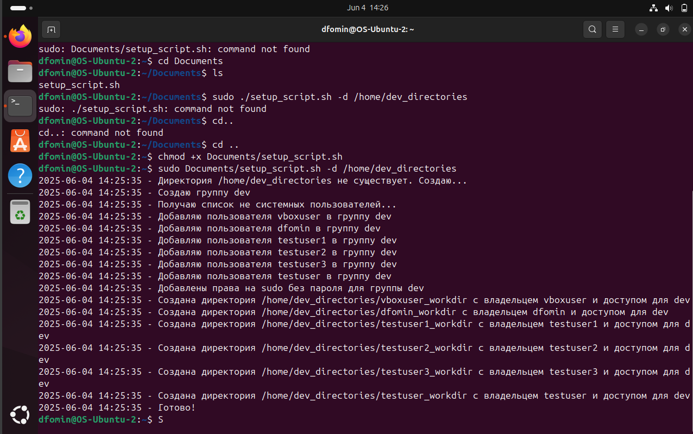

# Bash Setup Script

Задание по bash:

Написать bash скрипт который:
- Создает группу dev в которую добавляются все "не системные" пользователи.
- Группе dev выдаются права на sudo без запроса пароля.
- Для всех пользователей создает директории по маске `<user_name>_workdir`
- Путь до создаваемых директорий должен задаваться через ключ -d, если ключ не задан, то параметр должен быть запрошен при запуске скрипта
- Создаваемые директории должны быть с правами 660, владелец - пользователь, группа - группа пользователя.
- Для всех созданных директорий должен быть прописан в доступ "чтение" для группы dev.
- Весь лог должен писаться и в stdout и в файл.

## Функциональность

Скрипт setup_script.sh выполняет следующие действия:

### 1. Создание группы `dev` и добавление пользователей

Результат:

### 2. Настройка sudo без пароля для группы dev

Результат:

### 3. Создание рабочих директорий `<user_name>_workdir`

Результат:

### 4. Назначение прав доступа на директории

Результат:

### 5. Доступ на чтение для группы dev

Команда в скрипте:

### 6. Логирование

