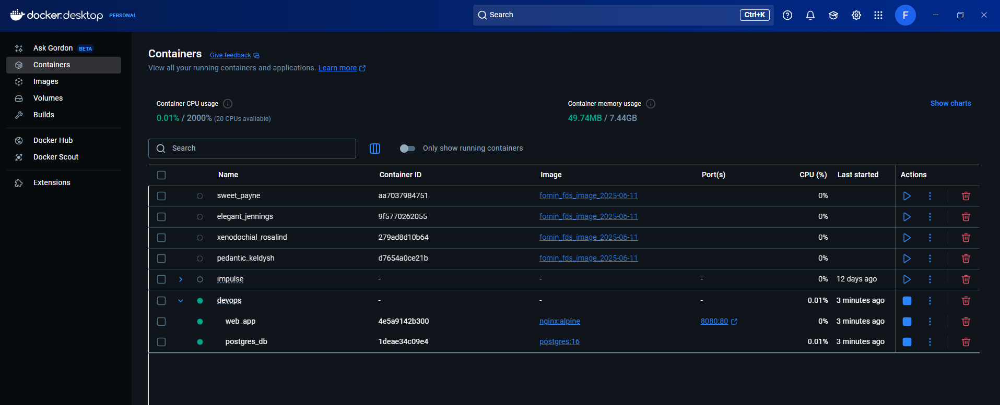
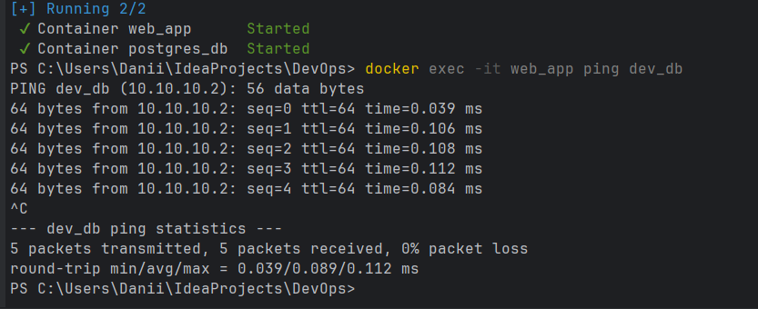
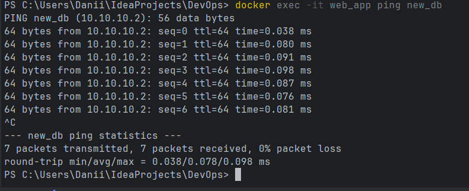

# docker-compose.yml creation

2) Напишите docker compose конфиг, для разворачивания двух контейнеров в одной сети (10.10.10.0/28) типа bridge:
   - Nginx или Apache или ваше самописное приложение на выбор, ему должны передаваться конфигурационные файлы через volume, порт 80 из контейнера должен быть доступен на хостовой машине по порту 8080
   - mysql или postgres, каталог для хранения данных должен монтироваться как docker volume, docker volume должен быть описан в том же конфигурационном файле docker compose. Сервис с БД должен быть доступен из контейнера с веб-сервером по именам new_db, dev_db.

## Функциональность

docker-compose.yml создал контейнер `devops`:

### Пинг по алиасам из docker-compose.yml:

