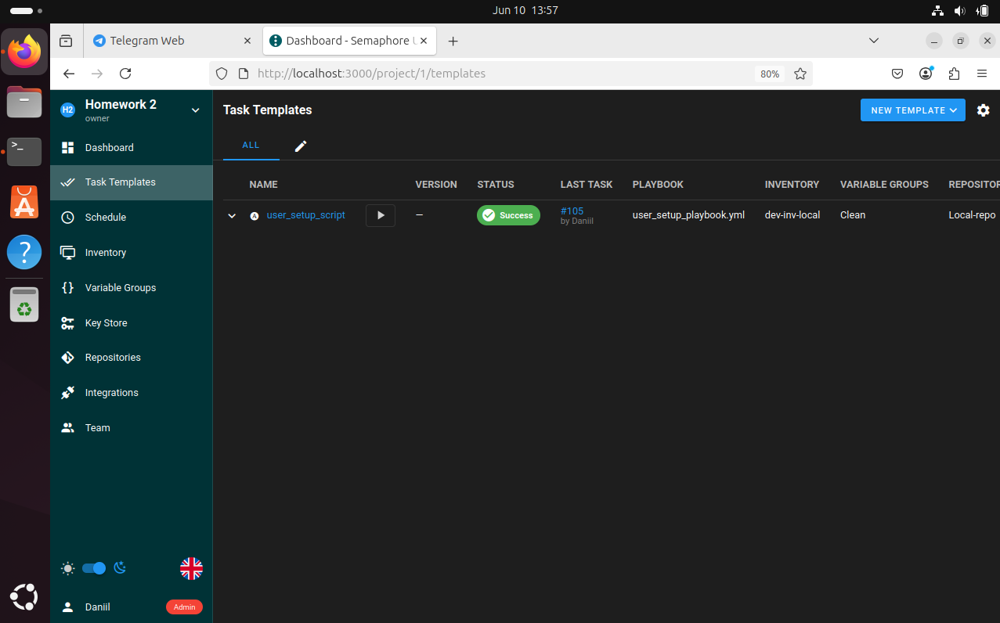
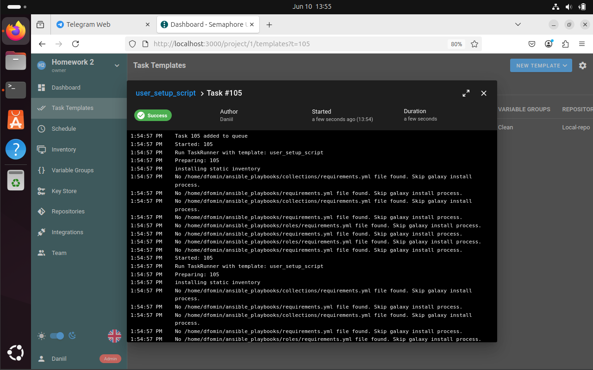
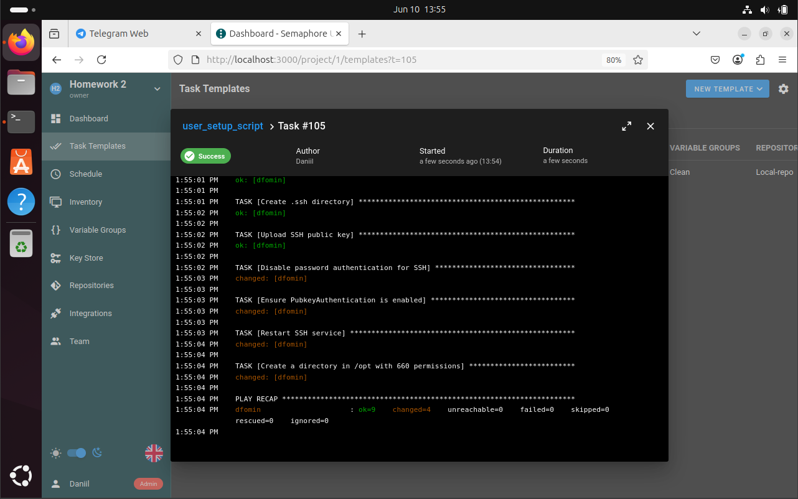
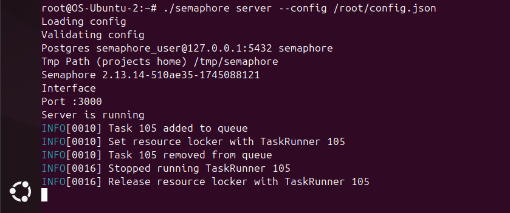
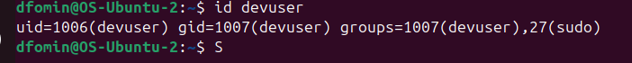
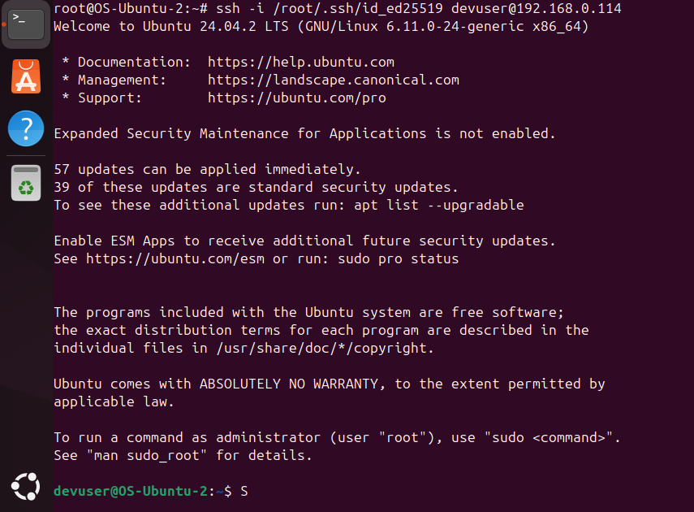
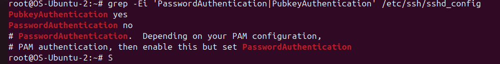
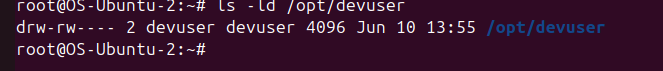

# Ansible User Setup Script Playbook

Задание по Ansible:

Написать playbook который должен будет:
- Создать пользователя на удаленной машине.
- Дать пользователю права sudo.
- Сделать авторизацию ssh по ключам для пользователя.
- Отключить авторизацию по паролю при ssh подключении.
- Создать директорию в /opt/ с правами 660 для пользователя.

## Функциональность

Плейбук выполнил следующие действия:

### 1. Создание пользователя `devuser` и добавление пользователя в группу sudo

Результат:

### 2. Авторизация ssh по ключам для пользователя

Результат:

### 3. Отключение авторизации по паролю при ssh подключении

Результат:

### 4. Создание директории в /opt/ с правами 660 для `devuser`

Результат:

