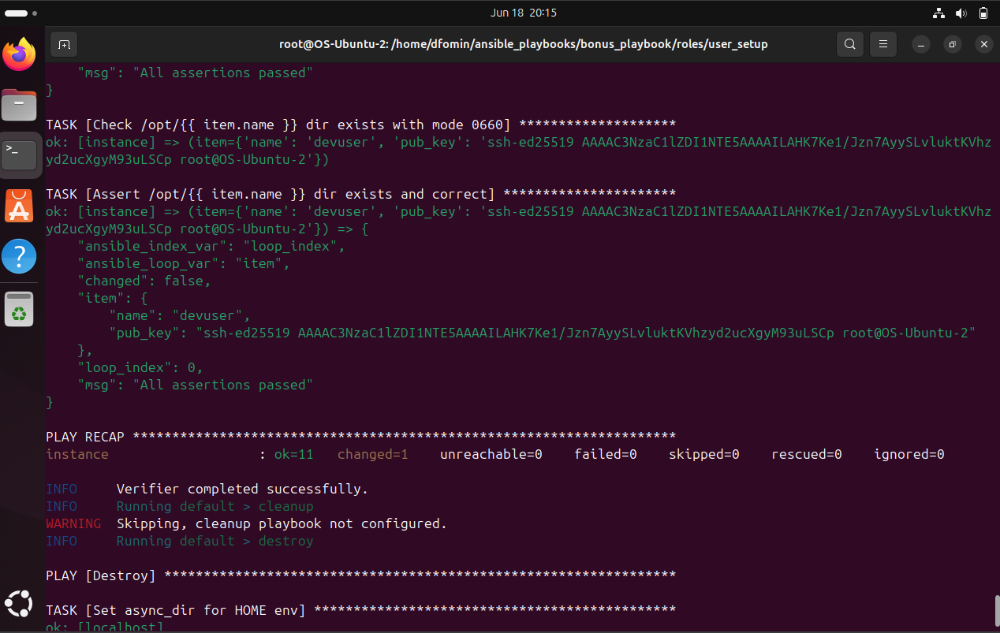

# Dockerfile creation

Бонусное задание (необязательное, доп балы):

Та же постановка задачи, что и на Ansible, но плюсом:
- Реализовать надо как несколько ansible role (задачи по пользователю отдельно, настройки ssh отдельно).
- Создаваемые пользователи и их открытые ключи для авторизации должны быть определены через vars
- Должно быть тестирование ролей через molecule (рекомендую выбрать  Driver/Provider docker)

## Функциональность

Прогнал molecule test для user_setup и ssh_script. Все .yml файлы (плейбуки, конфигурации и тп.) лежат в bonus_playbook директории в проекте.

### Результат для user_setup:

### Результат для ssh_config:

